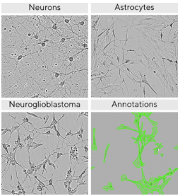
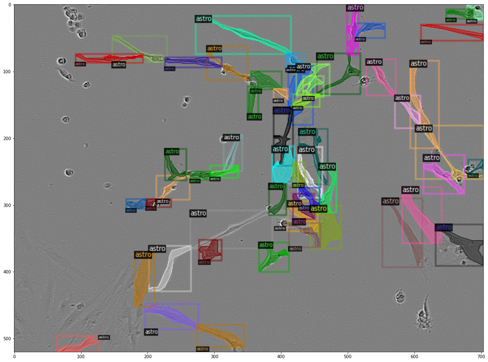

# Sartorius---Cell-Instance-Segmentation
https://www.kaggle.com/competitions/sartorius-cell-instance-segmentation
*  This is a Code Competition.
*  GPU Notebook <= 9 hours run-time.
*  Internet access disabled.
## NCKU "Machine Learning" - (Competition)
### Competition Description
  For this semester's final project, our focus is on the instance segmentation competition for neural cells hosted by the internationally renowned biotechnology and pharmaceutical company, Sartorius, on Kaggle [1]. Neurological disorders remain a leading cause of global mortality and disability. The lack of effective quantitative methods for assessing the therapeutic efficacy of diseases poses challenges in devising treatment plans and developing new drugs. Traditional examination methods involve observing the morphology of neural cells through optical microscopes, but the vast number of neural cells makes precise judgment and quantification by human efforts challenging.
  
  Therefore, AI assistance is crucial for analysis, and the initial step in AI analysis involves segmenting individual neural cells. Accurate segmentation of different neural cells enables quantitative data analysis with the aid of AI. Researchers can measure the impact of therapeutic drugs on neural cells, facilitating the advancement of new drug development.
  
  The primary objective of this competition is to address the diverse appearance changes in the most challenging SH-SY5Y type neural cells.

### Dataset Download
```shell
kaggle competitions download -c sartorius-cell-instance-segmentation
```


In order to prevent the database from being deleted, I first backed it up to my personal cloud space.

* [(Dataset-GoogleDrive Link)](https://drive.google.com/file/d/1n76PHLwMhEj7LdhSUDbYDPOv75D06bkU/view?usp=sharing) & [(Annotation-json_file)](https://drive.google.com/drive/folders/15_k-MsnejPnD18CqypdHxiF3MBW0hu1D?usp=sharing)


### Dependencies
```shell
sudo apt-get update
sudo apt-get install ffmpeg libsm6 libxext6  -y
pip install pycocotools
pip install 'git+https://github.com/facebookresearch/detectron2.git'
pip install fastcore
pip install ensemble-boxes
pip install nms
```

### Methods
#### **Detailed description of each part is in [PDF File](https://github.com/chia-shein/Sartorius---Cell-Instance-Segmentation/blob/main/sartorius_methods.pdf).**
1. Mask R-CNN
2. Model Ensembling
3. Image Normalizarion
4. Augmentation
5. Test Time Augmentation

### code
#### showimg.py
* Check the images and the annotation inside the dataset.
```shell
python showimg.py
```
#### train.py
* training the model.
```shell
python train.py
```
#### inference.py
* Inference the model with the final model .pth file.
```shell
python inference.py
```
#### ensemble_inference.py
* Ensemble multiple models or difference test time augmentation.
```shell
python ensemble_inference.py
```

### Experiment Results
#### 1. Sartorius Cell Segmentation Ablation Results

|   NO   |  Backbone  |  Training Iteration  |   Model Ensemble  |  Imagenet Normalization   |  Color Augmentation   |  Test Time Augmentation   |  mAP   |
|:------:|:------:|:------:|:------:|:------:|:------:|:------:|:------:|
| 1 | ResNet50 | 4,000 | - | - | - | - | 0.285 |
| 2 | ResNet50 + ResNeXt101 | 4,000 | v | - | - | - | 0.291 |
| 3 | ResNet50 + ResNeXt101 | 4,000 | v | v | - | - | 0.293 |
| 4 | ResNet50 + ResNeXt101 | 4,000 | v | - | v | - | 0.288 |
| 5 | ResNet50 + ResNeXt101 | 4,000 | v | - | - | v | 0.25 |

From the table, it is evident that different models may learn different information. Utilizing model ensembling to combine the predictions of two models results in a slight improvement in mAP compared to using a single model. However, during testing, the introduction of multiple augmentations to generate diverse Test Time Augmentations (TTA) from input images leads to a significant decrease in mAP. This phenomenon could be attributed to the dataset's characteristics, where cells are small and densely packed. The varied augmentations in TTA may produce overlapping detections that are excluded during fusion, causing a decline in accuracy.

In addition, normalizing input images using the pixel mean and pixel standard deviation from ImageNet versus those from the dataset itself shows no significant difference. In fact, using ImageNet's pixel mean and pixel standard deviation yields a slightly higher mAP. Unexpectedly, introducing color variations as part of the augmentation during training results in a minor decrease in mAP. This discrepancy between experimental results and initial expectations may be due to the relatively uniform and limited color variation in the cell segmentation dataset. Consequently, the choice of normalization appears to have minimal impact on the network's learning, while augmentations introducing color variations create data with distributions differing from the dataset, thereby affecting model accuracy.

#### 2. Sartorius Cell Segmentation Results

|   NO   |  Backbone  |  Training Iteration  |   Model Ensemble  |  mAP   |
|:------:|:------:|:------:|:------:|:------:|
| 1 | ResNet50 | 9,679 | -  | 0.300 |
| 2 | ResNet50 | 10,679 | - | 0.302 |
| 3 | ResNet50 + ResNet50 | 10,679 | v | 0.303 |
| 4 | ResNet50 + ResNet50 | 11,679 | v | 0.304 |

Normalization of input images was performed using the pixel mean and standard deviation from ImageNet. Two models were separately trained over an extended period, each employing a lightweight ResNet-50 as the backbone for Mask R-CNN. During testing, a model ensemble approach was adopted, combining the detection results of the two models. It is important to note that due to constraints in the competition environment, both the storage space and computational time were limited, influencing the choice of a lightweight backbone and the overall training duration for the models.

### Competition Result

