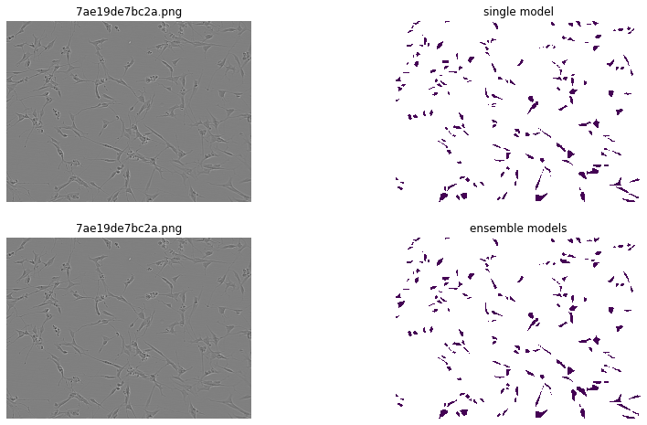
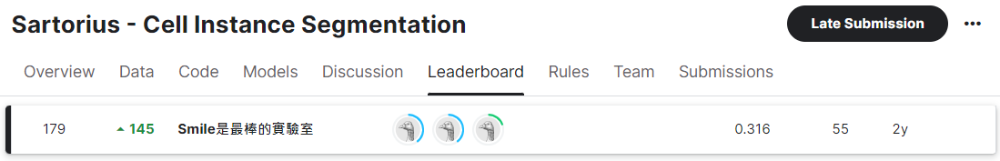

# Sartorius---Cell-Instance-Segmentation
https://www.kaggle.com/competitions/sartorius-cell-instance-segmentation
*  This is a Code Competition.
*  GPU Notebook <= 9 hours run-time.
*  Internet access disabled.
## NCKU "Machine Learning" - (Competition)
### Competition Description
  For this semester's final project, our focus is on the instance segmentation competition for neural cells hosted by the internationally renowned biotechnology and pharmaceutical company, Sartorius, on Kaggle [1]. Neurological disorders remain a leading cause of global mortality and disability. The lack of effective quantitative methods for assessing the therapeutic efficacy of diseases poses challenges in devising treatment plans and developing new drugs. Traditional examination methods involve observing the morphology of neural cells through optical microscopes, but the vast number of neural cells makes precise judgment and quantification by human efforts challenging.
  
  Therefore, AI assistance is crucial for analysis, and the initial step in AI analysis involves segmenting individual neural cells. Accurate segmentation of different neural cells enables quantitative data analysis with the aid of AI. Researchers can measure the impact of therapeutic drugs on neural cells, facilitating the advancement of new drug development.
  
  The primary objective of this competition is to address the diverse appearance changes in the most challenging SH-SY5Y type neural cells.

### Dataset Download
```shell
kaggle competitions download -c sartorius-cell-instance-segmentation
```


In order to prevent the database from being deleted, I first backed it up to my personal cloud space.

* [(Dataset-GoogleDrive Link)](https://drive.google.com/file/d/1n76PHLwMhEj7LdhSUDbYDPOv75D06bkU/view?usp=sharing) & [(Annotation-json_file)](https://drive.google.com/drive/folders/15_k-MsnejPnD18CqypdHxiF3MBW0hu1D?usp=sharing)


### Dependencies
```shell
sudo apt-get update
sudo apt-get install ffmpeg libsm6 libxext6  -y
pip install pycocotools
pip install 'git+https://github.com/facebookresearch/detectron2.git'
pip install fastcore
pip install ensemble-boxes
pip install nms
```

### Methods
#### **Detailed description of each part is in [PDF File](https://github.com/chia-shein/Sartorius---Cell-Instance-Segmentation/blob/main/sartorius_methods.pdf).**
1. Mask R-CNN
2. Model Ensembling
3. Image Normalizarion
4. Augmentation
5. Test Time Augmentation

### code
#### showimg.py
* Check the images and the annotation inside the dataset.
```shell
python showimg.py
```
#### train.py
* training the model.
```shell
python train.py
```
#### inference.py
* Inference the model with the final model .pth file.
```shell
python inference.py
```
#### ensemble_inference.py
* Ensemble multiple models or difference test time augmentation.
```shell
python ensemble_inference.py
```


### Experiment Results
#### **Detailed description of each table is in [PDF File](https://github.com/chia-shein/Sartorius---Cell-Instance-Segmentation/blob/main/sartorius_methods.pdf).**
#### 1. Sartorius Cell Segmentation Ablation Results

|   NO   |  Backbone  |  Training Iteration  |   Model Ensemble  |  Imagenet Normalization   |  Color Augmentation   |  Test Time Augmentation   |  mAP   |
|:------:|:------:|:------:|:------:|:------:|:------:|:------:|:------:|
| 1 | ResNet50 | 4,000 | - | - | - | - | 0.285 |
| 2 | ResNet50 + ResNeXt101 | 4,000 | v | - | - | - | 0.291 |
| 3 | ResNet50 + ResNeXt101 | 4,000 | v | v | - | - | 0.293 |
| 4 | ResNet50 + ResNeXt101 | 4,000 | v | - | v | - | 0.288 |
| 5 | ResNet50 + ResNeXt101 | 4,000 | v | - | - | v | 0.25 |

#### 2. Sartorius Cell Segmentation Results

|   NO   |  Backbone  |  Training Iteration  |   Model Ensemble  |  mAP   |
|:------:|:------:|:------:|:------:|:------:|
| 1 | ResNet50 | 9,679 | -  | 0.300 |
| 2 | ResNet50 | 10,679 | - | 0.302 |
| 3 | ResNet50 + ResNet50 | 10,679 | v | 0.303 |
| 4 | ResNet50 + ResNet50 | 11,679 | v | 0.304 |

### Competition Result
Our submitted model achieved an mAP of **0.304**, securing the **179th** position out of 1506 on the competition leaderboard.


### Conclusion and Future work
By employing model ensembling with two Mask R-CNN models trained over an extended period, the final model achieved an mAP of 0.304 for neural cell instance segmentation. In the future, it may be worthwhile to consider incorporating a semi-supervised approach by introducing additional unlabeled images for training. This strategy would enable the model to learn better neural cell image features from a more diverse set of data, potentially leading to increased accuracy.
